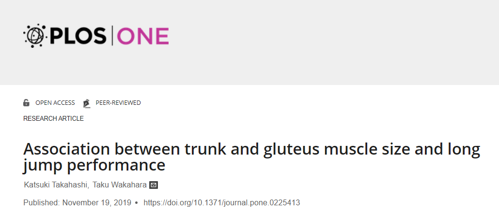

```{r setup, include=FALSE}
knitr::opts_chunk$set(echo = TRUE,
                      warning = FALSE,
                      error = FALSE,
                      message = FALSE,
                      fig.align = "center",
                      fig.width = 8.5,
                      fig.height = 5,
                      collapse = TRUE)
```


# Artículo científico

<center>

</center>

# Datos

- Datos tomados del artículo referenciado previamente.
- [Fuente de datos](https://journals.plos.org/plosone/article?id=10.1371/journal.pone.0225413#pone-0225413-g001)
- <tred>**Nota:**</tred> los análisis no arrojan exactamente los mismos resultados porque se tienen valores ausentes en algunas variables.

# Lectura de datos

```{r}
library(readxl)
library(tidyverse)
datos <- read_xlsx("../data/Data_Paper_Plos_One_Muscle.xlsx", skip = 3,
                   na = "N/A", n_max = 47) %>% 
  rename(RA_takeof_leg = RA...7,
         OB_takeof_leg = OB...8,
         PM_takeof_leg = PM...9,
         QL_takeof_leg = QL...10,
         ES_takeof_leg = ES...11,
         Gmax_takeof_leg = Gmax...12,
         Gmed_takeof_leg = Gmed...13,
         IL_takeof_leg = IL...14,
         RA_free_leg = RA...15,
         OB_free_leg = OB...16,
         PM_free_leg = PM...17,
         QL_free_leg = QL...18,
         ES_free_leg = ES...19,
         Gmax_free_leg = Gmax...20,
         Gmed_free_leg = Gmed...21,
         IL_free_leg = IL...22,
         id = ID,
         edad = `Age (years)`,
         altura_cm = `Height (cm)`,
         imc = `Body mass (kg)`,
         dist_salto_cm = `long jump distance (cm)`,
         sprint_100m_seconds = `100-m sprint time (s)`,
         grasa_subcut_cm2 = `Subcutaneous fat CSA (absolute value, cm2)`)
datos
```

# Objetivos

- Replicar análisis estadísticos aplicados en el artículo científico de interés.
- Evidenciar la relación existente entre características anatómicas de atletas vs rendimiento en salto largo.
- Evaluar otros métodos de [*statistical learning*](https://edimer.github.io/documents_R/LinearModels_LeastSquares/LinearModels_LeastSqauares.html#1) y compararlos con los resultados obtenidos por los autores.

# Resultados del *paper* 

## Correlaciones 

- Aunque fueron numerosos los resultados obtenidos por los autores, para el objetivo de este documento se destacan los siguientes:
    - La relación entre el área transversal relativa (CSA) del recto abdominal (AR) del lado de la pierna de despegue y el mejor registro personal para el salto largo.
        - **Correlación:** 0.674
        - **Valor p:** 0.004 (estadísticamente significativo)

- Las correlaciones (con intervalo de confianza del 95%) se presentan en la siguiente tabla:

<center>

</center>

## Gráfico de dispersión {.tabset .tabset-fade .tabset-pills}

### Original

<center>

</center>

### Réplica con R

```{r}
library(ggplot2)
datos %>% 
  ggplot(data = ., aes(x = RA_takeof_leg, y = dist_salto_cm)) +
  geom_point(size = 3) +
  labs(x = expression('Relative CSA of RA takeoff leg side - cm'^"2"/'kg'^"2/3)"),
       y = "Personal best record of long jump (cm)") +
  geom_smooth(method = "lm", se = FALSE, lty = 3, lwd = 1, color = "black") +
  theme_light()
```

