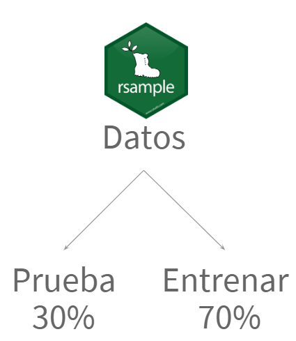

```{r, include=FALSE}
knitr::opts_chunk$set(echo = TRUE,
                      fig.align = "center",
                      fig.width = 7,
                      fig.height = 4.5,
                      warning = FALSE,
                      message = FALSE)
```

# Etapas de análisis

<center>

</center>

# Bibliotecas para *Data Science*

<center>

</center>

# Material

- [Turorial página web RStudio - Edgar Ruíz](https://resources.rstudio.com/espanol/tensorflow-y-r)
- [Github Edgar Ruíz - Tensor Flow con R](https://github.com/edgararuiz/tensorflow-con-R)
- [Datos de ejemplo: Predicción de pérdida de clientes](https://github.com/edgararuiz/tensorflow-con-R/blob/master/Rmd/customer_churn.csv)

# Instalación de herramientas

```{r}
install.packages("tensorflow")
install.packages("keras")

library(keras)
library(tensorflow)

install_keras()
install_tensorflow()
```

# Lectura de datos

```{r}
library(tidyverse)
datos <- read_csv("data/customer_churn.csv")
datos
```

# Preprocesamiento de datos

## Train y Test

<center>

</center>

```{r}
library(rsample)
id_partition <- initial_split(data = datos, prop = 0.3)
df_train <- training(id_partition)
df_test <- testing(id_partition)
```

## "Receta" 

<center>

</center>

```{r}
library(recipes)
depuration <- df_train %>% 
  recipe(Churn ~ .) %>%                                 # Forma del modelo
  step_rm(customerID) %>%                               # Remueve columnas
  step_naomit(all_outcomes(), all_predictors()) %>%     # Omitir NAs
  step_discretize(tenure, options = list(cuts = 6)) %>% # Discretiza variables 
  step_log(TotalCharges) %>%                            # Conversión logarítmica
  step_mutate(Churn = ifelse(Churn == "Yes", 1, 0)) %>% # Conversión binaria
  step_dummy(all_nominal(), -all_outcomes()) %>%        # Variables dummy
  step_center(all_predictors(), -all_outcomes()) %>%    # Centrar valores
  step_scale(all_predictors(), -all_outcomes()) %>%     # Centrado de variables
  prep()
```

## Aplicación de "Receta"

### Train

```{r}
# Predictores 
x_df_train <- depuration %>% 
  juice(all_predictors(),
        composition = "matrix")

# Respuesta
y_df_train <- depuration %>% 
  juice(all_outcomes()) %>% 
  pull()
```

### Test

```{r}
# Preprocesado base
base_test <- bake(object = depuration, new_data = df_test)

# Predictores
x_df_test <- base_test %>% 
  select(-Churn) %>% 
  as.matrix()

# Respuesta
y_df_test <- base_test %>% 
  select(Churn) %>% 
  pull()
```

# Entrenamiento de modelos

## Preparación con `keras`

<center>

</center>

- Guías para complementar la preparación del modelo con `keras`:
    - [Modelo secuencial `keras`](https://keras.io/getting-started/sequential-model-guide/)
    - [Machine Learning con `caret` y `keras` - Edimer](https://rpubs.com/Edimer/536034)

```{r}
modelo_keras <- keras_model_sequential() %>% 
  layer_dense(units = 16,
              kernel_initializer = "uniform",
              activation = "relu",
              input_shape = ncol(x_df_train)) %>% 
  layer_dropout(rate = 0.1) %>% 
  layer_dense(units = 16,
              kernel_initializer = "uniform",
              activation = "relu") %>% 
  layer_dropout(rate = 0.1) %>% 
  layer_dense(units = 1,
              kernel_initializer = "uniform",
              activation = "sigmoid") %>% 
  compile(optimizer = "adam",
          loss = "binary_crossentropy",
          metrics = c("accuracy"))
```

## Ajuste del modelo

<center>

</center>

```{r}
resultado <- fit(
  object = modelo_keras,
  x = x_df_train,
  y = y_df_train,
  batch_size = 50,
  epochs = 35,
  validation_split = 0.30,
  verbose = 0
)

plot(resultado) +
  theme_bw()
```

## Predicciones

```{r}
# Predicción de clases 
rta_class <- modelo_keras %>% 
  predict_classes(x_df_test) %>% 
  as.factor() %>% 
  fct_recode(yes = "1", no = "0")

# Predicción de probabilidades
rta_probs <- modelo_keras %>% 
  predict_proba(x_df_test) %>% 
  as.vector()

# Valores reales en test
real_test <- y_df_test %>% 
  as.factor() %>% 
  fct_recode(yes = "1", no = "0")

# Juntando predichos y reales
df_real_predict <- tibble(
  real = real_test,
  predicho = rta_class,
  predicho_prob = rta_probs
)
df_real_predict
```

# Validación del modelo

## Métricas de desempeño

<center>

</center>

```{r}
library(yardstick)
```

- **Matriz de confusión:**

```{r}
conf_mat(data = df_real_predict, truth = real, estimate = predicho)
```

- **Accuracy y Kappa:**

```{r}
metrics(data = df_real_predict, truth = real, estimate = predicho)
```

- **Área bajo la curva (ROC):**

```{r}
roc_auc(data = df_real_predict, real, predicho_prob)
```

- **Precisión:**

```{r}
precision(data = df_real_predict, truth = real, estimate = predicho)
```

- **Sensitividad:**

```{r}
recall(data = df_real_predict, truth = real, estimate = predicho)
```

- **Medidas F:**

```{r}
f_meas(data = df_real_predict, truth = real, estimate = predicho, beta = 1)
```

## Entendiendo el modelo *black box*

<center>

</center>

```{r}
library(lime)
suppressWarnings(explicar <- x_df_train %>% 
  as_tibble() %>%  
  lime(modelo_keras, bin_continuous = FALSE))

explanation <- x_df_test %>% 
  as_tibble() %>%
  lime::explain(
    explainer = explicar, n_labels = 1,
    n_features = 2, kernel_width = 0.5
  )
```

# Recursos

- [Aprendizaje automático con Tensorflow y R](https://resources.rstudio.com/espanol/tensorflow-y-r)
- [Deep Learning with Keras & Lime in R](https://rpubs.com/iamkbpark/deep-keras-lime)