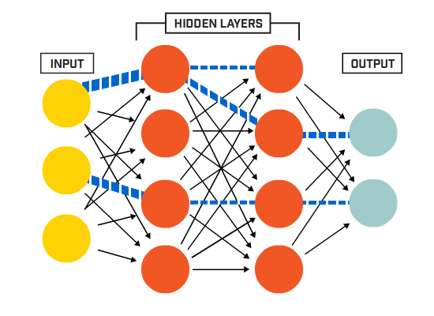
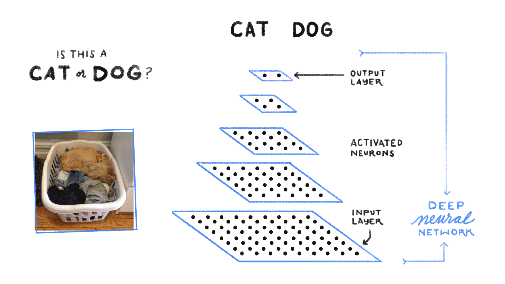

```{r setup, include=FALSE}
knitr::opts_chunk$set(echo = FALSE,
                      warning = FALSE,
                      error = FALSE,
                      message = FALSE,
                      fig.align = "center",
                      fig.width = 8.5,
                      fig.height = 5,
                      collapse = TRUE)
```

<center>

</center>

# Datos

- [Fuente - UCI Machine Learning Repository: Datos de cáncer de seno.](https://archive.ics.uci.edu/ml/datasets/Breast+Cancer+Coimbra)
- **Problema:** entrenar modelos de aprendizaje automático - *aprendizaje supervisado*, para detectar cáncer de seno. Las variables son constituidas como predictores que pueden ser parametrizadas y servir como biomarcadores de cáncer.
- Variable respuesta:
    - **0**: pacientes saludables.
    - **1**: pacientes enfermos.

# Metodología

1. Lectura de datos.  
2. Exploración de datos.  
  2.1. Proporción de enfermos y sanos.  
  2.2. Distribuciones de probabilidad.   
  2.3. Correlaciones de variables predictoras.  
  2.4. Tendencias por edad del paciente.  
3. Preprocesamiento de datos.  
  3.1. Partición en *Training* y *Testing*.  
  3.2. Normalización de variables.    
  3.3. Recodificación de variable respuesta ***Classification*** ("0": paciente sano y "1": paciente enfermo).  
  3.4. Preprocesamiento específico para implementación de redes neuronales profundas (*deep learning*) con bibliotecas `keras` y `lime`.    
4. Ajuste de modelos de Machine Learning - Supervised Learning:  
  4.1. K-Nearest Neighbor.    
  4.2. Naive Bayes.    
  4.3. Regresión Logística.    
  4.4. Árbol de decisión (clasificación).      
  4.5. Random Forest.    
  4.6. Support Vector Machine.      
  4.7. Gradient Boosting.      
  4.8. Deep Learning (Multilayer Perceptron).    
5. Desempeño de los modelos: comparación de *Accuracy* en *Training* y *Testing*.  
6. Referencias

# Resultados {.tabset .tabset-fade .tabset-pills}

## 1. Lectura de datos

```{r}
library(readxl)
library(dplyr)
df_seno <- read_xlsx("Datos/Cancer_Seno.xlsx")
df_seno$Classification <- as.numeric(df_seno$Classification)-1
df_seno
```

## 2. Análisis exploratorio

### Proporción de enfermos y sanos

```{r}
# Proporción de enfermos y sanos
prop.table(table(df_seno$Classification))*100
```

### Distribuciones 
<center>
```{r, fig.height=6}
library(RColorBrewer)
colores2 <- brewer.pal(n = 6, name = "Set1")[c(2,5)]
library(ggplot2)
library(tidyr)
df_seno %>% 
  mutate(Classification = factor(Classification)) %>% 
  gather(key = "variable", value = "valor", -Classification) %>% 
  ggplot(data = ., aes(x = valor, fill = Classification)) +
  facet_wrap(facets = ~variable, scales = "free") +
  geom_density(alpha = 0.7) +
  scale_fill_manual(values = colores2) +
  labs(x = "", y = "", fill = "Clasificación:") +
  theme_test() +
  theme(legend.position = "bottom")
```
</center>

### Correlaciones
<center>
```{r, fig.width=9, fig.height=6}
library(corrplot)
mtx_cor <- cor(df_seno[, -10])
corrplot(mtx_cor, method = "pie", type = "upper", diag = FALSE,
         tl.srt = 40, tl.col = "black", tl.cex = 1,
           col = brewer.pal(n = 5, name = "Spectral"), order = "hclust")
```
</center>

### Tendencias por edad
<center>
```{r, fig.height=6.5, fig.width=8.5}
df_seno %>% 
  mutate(Classification = factor(Classification)) %>% 
  gather(key = "variable", value = "valor", -c(Classification, Age)) %>% 
  ggplot(data = ., aes(x = Age, y = valor, color = Classification)) +
  facet_wrap(facets = ~variable, scales = "free") +
  geom_point(alpha = 0.6) +
  geom_smooth(se = FALSE, lwd = 1.2) +
  scale_color_manual(values = colores2) +
  labs(x = "Edad (años)", y = "", fill = "Clasificación:") +
  theme_test() +
  theme(legend.position = "bottom")
```
</center>

## 3. Preprocesamiento

### Train y Test

- Primero se convierte en `factor` la variable respuesta que está codificada como `numeric`. Este paso es importante para garantizar que las proporciones de cada clase (enfermo o sano) se mantengan en las bases de datos train y test.
- Se usa la biblioteca `caret` con la función `CreateDataPartition()`.
- La partición se realizó 70-30%, para train y test, respectivamente.
- **Nota:** la función implementada tiene en cuenta la proporción de la variable respuesta para el train y test, no obstante, no hace énfasis en la variabilidad de predictores (problemas de varianza igual a cero).

```{r, echo=TRUE}
set.seed(1000)
library(caret)
df_seno$Classification <- as.factor(df_seno$Classification)
ind <- createDataPartition(y = df_seno$Classification, times = 1,
                           p = 0.7, list = FALSE)
df_train <- df_seno[ind, ]
df_testi <- df_seno[-ind, ]
```

### Normalización

- La [normalización o estandarización](https://en.wikipedia.org/wiki/Feature_scaling) de variables puede ser efecutada de maneras diferentes:
    - **Escalado Min-Max**: $z_i = x-mínimo_x/(máximo_x-mínimo_x)$. La variable queda acotada entre [0, 1].
    - **Estandarización**: $x - \mu_x/\sigma_x$. La variable queda acotada entre [-1, 1], con $\mu = 0$ y $\sigma = 1$.
- La normalización o estandarización de variables es necesaria para la ejecución de algunos algoritmos como las redes neuronales, las máquinas de soporte vectorial o la regresión logística. Este proceso es necesario cuando las unidades de las variables son diferentes, tratando de evitar el sobrepeso (mayor importancia para el modelo) en variables que posean mayor variabilidad (varianza).
- En R se pueden implementar las funciones `scale()` para escalar o estandarizar las variables y la función `normalize()` del paquete `keras` permite aplicar la normalización min-max.
- Para este ejemplo las variables serán normalizadas con la función `normalize()` de la biblioteca `keras`.

```{r, echo=TRUE}
library(keras)
df_train[, 1:9] <- normalize(df_train[, 1:9])
df_testi[, 1:9] <- normalize(df_testi[, 1:9])
```

- A manera de ejemplo se muestra el rango de las variables `df_train`. Corroborando que ninguna de las variables posee valores inferiores a cero o mayores a 1.

```{r, echo=TRUE, collapse=TRUE}
apply(df_train, 2, range)
```

### Recodificación de `Classification`

- Para el modelo de red neuronal profunda implementado a través de `keras`, es necesario convertir la variable respuesta en [*Dummy*](https://en.wikipedia.org/wiki/Dummy_variable_(statistics)), en regresión se suele hablar de variables *indicadoras*, aunque también es conocido como [*one-hot encoding* (codificación activa)](https://en.wikipedia.org/wiki/One-hot) en Machine Learning.
- La función `to_categorical()` del paquete `keras` permite esta conversión.

```{r, echo=TRUE}
y_train <- to_categorical(df_train$Classification)
y_testi <- to_categorical(df_testi$Classification)
```

### Preprocesamiento para `keras`

- Para ajustar el modelo secuencial con `keras` es necesario coercionar las bases de datos (`data.frame`) train y test a la clase `matrix`, de la misma manera que quedó coercionada la variable respuesta en el paso anterior.
- En `keras` y muchas otras bibliotecas para Machine Learning los modelos se expresan en términos matriciales; esto debido a la eficiencia algebráica para procesamiento de información. Este requisito no es obligatorio en todos los modelos, puesto que algunos aceptan las variables declaradas como fórmula (`formula = y ~ x + w + z`).

```{r, echo=TRUE}
# Coerción a matriz
x_train <- as.matrix(df_train[, 1:9])
x_testi <- as.matrix(df_testi[, 1:9])

# Eliminando dimensiones
dimnames(x_train) <- NULL
dimnames(x_testi) <- NULL
```

## 4. Modelos

- Se usan las bibliotecas `caret`, y `keras` para entrenar los modelos de Machine Learning.
- A través de validación cruzada (k = 10 y repeticiones = 10) se evalúa el desempeño de los modelos.
- La métrica a tener en cuenta para comparar los modelos es la `Accuracy` o precisión del modelo.
- Todos los procedimientos con `caret` son paralelizados con la biblioteca `doMC`.

### K-Nearest Neighbor

- **Características generales:**
    - Uno de los algoritmos de Machine Learning más simples.
    - Fundamentado en identificar observaciones que se asemejen a las observaciones vecinas para realizar predicciones.
    - Una nueva observación se predice en función de su "similitud" con otras observaciones ("vecinos más cercanos").
    - La "similitud" con otras observaciones es cuantificada con métricas de distancia, por ejemplo, distancia *Euclidiana*.
    - Pueden ser computacionalmente ineficientes y son conocidos como *lazy learners* ([Cunningham & Delany, 2007](https://pdfs.semanticscholar.org/60f3/89f056ae250d896eb80b414a933537d51d6c.pdf)).
    - Hiperparámetro `k`: número de observaciones vecinas empleadas para realizar la predicción.
    - Algunos casos de uso:
        - Categorización de texto ([Jiang et al., 2012](https://www.researchgate.net/publication/232406523_An_Improved_k-Nearest_Neighbor_Algorithm_for_Text_Categorization)).
        - Detección de Spam en Twitter ([McCord & Chuah, 2011](http://wbox0.cse.lehigh.edu/~chuah/publications/atc11_spam_camera.pdf)).
        - Clasificación de tumores cerebrales con imágenes hiper-espectrales ([Florimbi et al., 2018](https://www.ncbi.nlm.nih.gov/pmc/articles/PMC6068477/)).
        - Selección de características - *Feature Engineering* ([Shenggiao et al., 2011](https://www.ncbi.nlm.nih.gov/pmc/articles/PMC3281073/)).

```{r, echo=TRUE}
# Paralelización del proceso
library(doMC)
library(parallel)
registerDoMC(cores = detectCores())

# Submuestras y repeticiones
particiones  <- 10
repeticiones <- 10

# Definiendo hiperparámetro k
hiperparametros <- expand.grid(k = seq(1, 30, 2))

# Semillas
set.seed(123)
seeds <- vector(mode = "list", length = (particiones * repeticiones) + 1)
for (i in 1:(particiones * repeticiones)) {
  seeds[[i]] <- sample.int(1000, nrow(hiperparametros)) 
}
seeds[[(particiones * repeticiones) + 1]] <- sample.int(1000, 1)

# Control de entrenamiento
cross_val <- trainControl(
  method = "repeatedcv",
  number = particiones,
  repeats = repeticiones,
  returnResamp = "final",
  verboseIter = FALSE,
  allowParallel = TRUE,
  seeds = seeds
)

# Ajuste del modelo (entrenamiento)
set.seed(1000)
mod_knn <- train(
  Classification ~ .,
  data = df_train,
  method = "knn",
  tuneGrid = hiperparametros,
  metric = "Accuracy",
  trControl = cross_val
)
```

- **Evaluando el $k$ óptimo:**

<center>
```{r}
ggplot(mod_knn) +
  labs(x = "Vecinos (k)", y = "Accuracy (cross validation)") +
  geom_point(aes(x = mod_knn$bestTune[[1]], y = max(mod_knn$results$Accuracy)),
             color = "red", pch = 17, size = 3) +
  labs(subtitle = "K-Nearests Neighbors") +
  theme_test()
```
</center>

- **Resultados del modelo (de mayor a menor accuracy):**

```{r}
mod_knn$results %>% 
  arrange(desc(Accuracy))
```

- **Accuracy en testing (matriz de confusión):**

```{r}
mod_final_knn <- mod_knn$finalModel
test_predic_knn <- predict(mod_final_knn, newdata = df_testi[, -10],
                           type = "class")

confusionMatrix(table(df_testi$Classification, test_predic_knn, 
                      dnn = c("Real", "Predicho")),
                positive = "1")
```

### Naive Bayes

- **Características:**
    - Se fundamenta en el cálculo de probabilidades condicionales basado en el [Teorema de Bayes.](https://es.wikipedia.org/wiki/Teorema_de_Bayes)
    - El algoritmo asume que existe independencia entre las variables predictoras, de ahí que su nombre sea *naive* (ingenuo en inglés). En la vida real esta suposición de independencia rara vez se cumple, no obstante, proporciona resultados favorables en variedad de aplicaciones.
    - Posee tres hiperparámetros:
        - `usekernel`: `TRUE` para utilizar un kernel que estime la densidad o `FALSE` para asumir una función de densidad gaussiana.
        - `fL`: `fL = 1` para aplicar el factor de corrección de *Laplace*. De utilidad cuando se tienen eventos o conjuntos vacios, es decir, ausencia de información que impide el cálculo de probabilidades de manera correcta.
        - `adjust`: parámetro que hace parte de la función `density()` en caso de `usekernel = TRUE`.
    - Algunos usos:
        - Clasificación de secuencias de RNA en taxonomía bacteriana ([Wang et al., 2007](https://www.ncbi.nlm.nih.gov/pmc/articles/PMC1950982/)).
        - Selección de características para entrenamiento de Support Vector Machine ([Cinelli et al., 2017](https://www.ncbi.nlm.nih.gov/pmc/articles/PMC5860388/)).
        - Eventos adversos de fármacos con base en citas de PubMed ([Wang et al., 2011](https://www.ncbi.nlm.nih.gov/pmc/articles/PMC3243206/)).
        - Extracción de características para clasificación de texto ([Sarkar et al., 2014](https://www.ncbi.nlm.nih.gov/pmc/articles/PMC4897287/)).
        - Estimación de ubicación (geoposicionamiento) probabilística ([Shauer, 2019](https://www.sciencedirect.com/topics/engineering/naive-bayes-classifier)).

```{r, echo=TRUE}
# Paralelización del proceso
library(doMC)
library(parallel)
registerDoMC(cores = detectCores())

# Submuestras y repeticiones
particiones  <- 10
repeticiones <- 10

# Definiendo hiperparámetro k
hiperparametros <- data.frame(usekernel = FALSE, fL = 0 , adjust = 0)

# Semillas
set.seed(123)
seeds <- vector(mode = "list", length = (particiones * repeticiones) + 1)
for (i in 1:(particiones * repeticiones)) {
  seeds[[i]] <- sample.int(1000, nrow(hiperparametros)) 
}
seeds[[(particiones * repeticiones) + 1]] <- sample.int(1000, 1)

# Control de entrenamiento
cross_val <- trainControl(
  method = "repeatedcv",
  number = particiones,
  repeats = repeticiones,
  returnResamp = "final",
  verboseIter = FALSE,
  allowParallel = TRUE,
  seeds = seeds
)

# Ajuste del modelo (entrenamiento)
set.seed(1000)
mod_bayes <- train(
  Classification ~ .,
  data = df_train,
  method = "nb",
  tuneGrid = hiperparametros,
  metric = "Accuracy",
  trControl = cross_val
)
```

- **Resultados del modelo:**

```{r}
mod_bayes$results %>% 
  arrange(desc(Accuracy))
```

- **Accuracy en testing (matriz de confusión):**

```{r}
mod_final_bayes <- mod_bayes$finalModel
test_predic_bayes <- predict(mod_final_bayes, newdata = df_testi[, -10],
                           type = "class")$class

confusionMatrix(table(df_testi$Classification, test_predic_bayes, 
                      dnn = c("Real", "Predicho")),
                positive = "1")
```

### Regresión Logística

- **Características:**
    - Algoritmos de amplio uso en estadística e incorporados hoy en día como parte de la caja de herramientas para Machine Learning.
    - Hace parte de los *Modelos Lineales Generalizados (GLM)*.
    - Permite modelar variables con distribución de errores no gaussianas o normales.
    - Aplica transformaciones sobre la variable respuesta original,  tratando de linealizar la relación con las predictoras a través de una función de enlace (*linkage*).
    - Es aplicable a problemas binomiales y multinomiales.
    - Algunos casos de uso:
        - Estudio comparativo de técnicas de predicción en pacientes con VIH ([Bisaso et al., 2018](https://www.ncbi.nlm.nih.gov/pmc/articles/PMC6123949/)).
        - Análisis del riesgo cardiovascular con datos clínicos ([Weng et al., 2017](https://journals.plos.org/plosone/article?id=10.1371/journal.pone.0174944)).
        - Detección de anomalías en el crecimiento fetal ([Kuhle et al., 2018](https://www.ncbi.nlm.nih.gov/pmc/articles/PMC6094446/)).
        - Clasificación de enfermedades a través de aprendizaje semisupervisado ([Chai et al., 2018](https://www.ncbi.nlm.nih.gov/pmc/articles/PMC6115447/)).
        - Artículo guía: entendiendo el análisis de regresión logística ([Sperandei, 2014](https://www.ncbi.nlm.nih.gov/pmc/articles/PMC3936971/)).

```{r, echo=TRUE}
# Paralelización del proceso
library(doMC)
library(parallel)
registerDoMC(cores = detectCores())

# Submuestras y repeticiones
particiones  <- 10
repeticiones <- 10

# Definiendo hiperparámetro k
hiperparametros <- data.frame(parameter = "none")

# Semillas
set.seed(123)
seeds <- vector(mode = "list", length = (particiones * repeticiones) + 1)
for (i in 1:(particiones * repeticiones)) {
  seeds[[i]] <- sample.int(1000, nrow(hiperparametros)) 
}
seeds[[(particiones * repeticiones) + 1]] <- sample.int(1000, 1)

# Control de entrenamiento
cross_val <- trainControl(
  method = "repeatedcv",
  number = particiones,
  repeats = repeticiones,
  returnResamp = "final",
  verboseIter = FALSE,
  allowParallel = TRUE,
  seeds = seeds
)

# Ajuste del modelo (entrenamiento)
set.seed(1000)
mod_regl <- train(
  Classification ~ .,
  data = df_train,
  method = "glm",
  tuneGrid = hiperparametros,
  metric = "Accuracy",
  trControl = cross_val
)
```

- **Resultados del modelo:**

```{r}
mod_regl$results %>% 
  arrange(desc(Accuracy))
```

- **Accuracy en testing (matriz de confusión):**

```{r}
mod_final_regl <- mod_regl$finalModel
test_predic_regl <- predict(mod_final_regl, newdata = df_testi[, -10],
                           type = "response")
test_predic_regl <- if_else(test_predic_regl < 0.5, true = "0", false = "1")

confusionMatrix(table(df_testi$Classification, test_predic_regl, 
                      dnn = c("Real", "Predicho")),
                positive = "1")
```

### Árbol de decisión

- **Características:**
    - Se fundamenta en la segmentación del espacio de predictores a través de reglas lógicas (booleanas) simples.
    - Hacen parte de los algoritmos no paramétricos.
    - Modelos de árbol pequeños son de fácil interpretación, además, son fáciles de visualizar.
    - Permiten modelar relaciones no lineales de manera sencilla.
    - Ignora facilmente las variables menos importantes.
    - A menudo presentan alta varianza en las predicciones.
    - Dentro de los algoritmos de árboles de decisión se destacan los siguientes:
        - [`CART`](https://medium.com/machine-learning-researcher/decision-tree-algorithm-in-machine-learning-248fb7de819e): algoritmo original de [Leo Breiman](https://en.wikipedia.org/wiki/Leo_Breiman).
        - [`ID3`](https://en.wikipedia.org/wiki/ID3_algorithm), [`C4.5`](https://en.wikipedia.org/wiki/C4.5_algorithm) y [`C5.0`](https://en.wikipedia.org/wiki/C4.5_algorithm#Improvements_in_C5.0.2FSee5_algorithm). Todos desarrollados por [Ross Quinlan](https://en.wikipedia.org/wiki/Ross_Quinlan).
    - La métrica de impureza utilizada por *CART* es Gini.
    - La métrica de impureza utilizada por *ID3, C4.5 y C5.0* es la entropía o ganancia de información.
    - Algunos casos de uso:
        - Predicción de gripe en pacientes de atención primaria ([Zimmerman et al., 2016](https://www.ncbi.nlm.nih.gov/pmc/articles/PMC5034457/)).
        - Árboles de decisión aplicados en servicios psiquiátricos ([Song & Lu, 2015](https://www.ncbi.nlm.nih.gov/pmc/articles/PMC4466856/)).
        - Predicción de accidentes laborales en fábrica de acero de Irán ([Shirali et al., 2018](https://www.ncbi.nlm.nih.gov/pubmed/30581805)).
        - Cambio en el uso del suelo basado en algoritmo CART ([Sang et al., 2019](https://www.ncbi.nlm.nih.gov/pmc/articles/PMC6706412/)).
        - Detección temprana de mastitis en vacas productoras de leche ([Zhang et al., 2015](http://web.eecs.utk.edu/~zzhang61/docs/papers/2015_EMBC_Mastitis.pdf)).

```{r, echo=TRUE}
# Paralelización del proceso
library(doMC)
library(parallel)
registerDoMC(cores = detectCores())

# Submuestras y repeticiones
particiones  <- 10
repeticiones <- 10

# Definiendo hiperparámetro k
hiperparametros <- data.frame(parameter = "none")

# Semillas
set.seed(123)
seeds <- vector(mode = "list", length = (particiones * repeticiones) + 1)
for (i in 1:(particiones * repeticiones)) {
  seeds[[i]] <- sample.int(1000, nrow(hiperparametros)) 
}
seeds[[(particiones * repeticiones) + 1]] <- sample.int(1000, 1)

# Control de entrenamiento
cross_val <- trainControl(
  method = "repeatedcv",
  number = particiones,
  repeats = repeticiones,
  returnResamp = "final",
  verboseIter = FALSE,
  allowParallel = TRUE,
  seeds = seeds
)

# Ajuste del modelo (entrenamiento)
set.seed(1000)
mod_c5tree <- train(
  Classification ~ .,
  data = df_train,
  method = "C5.0Tree",
  tuneGrid = hiperparametros,
  metric = "Accuracy",
  trControl = cross_val
)
```

- **Resultados del modelo:**

```{r}
mod_c5tree$results %>% 
  arrange(desc(Accuracy))
```

- **Accuracy en testing (matriz de confusión):**

```{r}
mod_final_c5tree <- mod_c5tree$finalModel
test_predic_c5tree <- predict(mod_final_c5tree, newdata = df_testi[, -10],
                           type = "class")

confusionMatrix(table(df_testi$Classification, test_predic_c5tree, 
                      dnn = c("Real", "Predicho")),
                positive = "1")
```

### Random Forest

- **Características:**
    - Considerado como parte de los métodos de *Bagging (bootstrap aggregation)* propuestos por [Leo Breiman](https://en.wikipedia.org/wiki/Leo_Breiman).
    - El *Bagging* surge como estrategía para el desequilibrio [bias-varianza](https://en.wikipedia.org/wiki/Bias%E2%80%93variance_tradeoff).
    - El término [*Bagging*](https://es.wikipedia.org/wiki/Agregaci%C3%B3n_de_bootstrap) hace referencia al empleo del muestreo repetido (bootstrapping).
    - El algoritmo en lugar de ajustar un sólo arbol de decisión permite la incorporación de muchos de estos, conformando lo que se denomina como "bosque". Se denomina "bosque aleatorio" porque selecciona aleatoriamente $m$ predictores para la construcción de los árboles.
    - Permite obtener métricas de importancia de variables, resultando en un método viable para seleccionar predictores.
    - En R puede ser implementado a través de la biblioteca `randomForest` o `ranger`. El método `ranger` posee tres hiperparámetros controlables:
        - `mtry`: número de predictores seleccionados aleatoriamente en cada árbol.
        - `min.node.size`: tamaño mínimo que debe tener un nodo para ser dividido.
        - `splitrule`: criterio de división (por defecto *gini*).
    - Algunos casos de uso:
        - Bosques aleatorios para clasificación de neuroimágenes en pacientes con Alzheimer ([Sarica et al., 2017](https://www.ncbi.nlm.nih.gov/pmc/articles/PMC5635046/)).
        - Identificación de fuentes de contaminación del agua a través de Bosques Aleatorios ([Roguet et al., 2018](https://www.ncbi.nlm.nih.gov/pmc/articles/PMC6194674/)).
        - Modelado de variables espaciales y espacio-temporales con Bosques Aleatorios ([Hengl et al., 2018](https://www.ncbi.nlm.nih.gov/pmc/articles/PMC6119462/)).
        - Extracción de características con Bosques Aleatorios para análisis de expresión génica con Deep Learning ([Kong & Yu, 2018](https://www.ncbi.nlm.nih.gov/pmc/articles/PMC6220289/)).
        - Predicción de cáncer de próstata con Bosques Aleatorios ([Xiao et al., 2017](https://www.ncbi.nlm.nih.gov/pmc/articles/PMC5566854/)).
        - Bosques Aleatorios para análisis de datos genómicos ([Chen & Ishwaran, 2013](https://www.ncbi.nlm.nih.gov/pmc/articles/PMC3387489/)).

```{r, echo=TRUE}
# Paralelización del proceso
library(doMC)
library(parallel)
registerDoMC(cores = detectCores())

# Submuestras y repeticiones
particiones  <- 10
repeticiones <- 10

# Definiendo hiperparámetro k
hiperparametros <- expand.grid(mtry = seq(1, 9, 1),
                               min.node.size = seq(1, 30, 2),
                               splitrule = "gini")

# Semillas
set.seed(123)
seeds <- vector(mode = "list", length = (particiones * repeticiones) + 1)
for (i in 1:(particiones * repeticiones)) {
  seeds[[i]] <- sample.int(1000, nrow(hiperparametros)) 
}
seeds[[(particiones * repeticiones) + 1]] <- sample.int(1000, 1)

# Control de entrenamiento
cross_val <- trainControl(
  method = "repeatedcv",
  number = particiones,
  repeats = repeticiones,
  returnResamp = "final",
  verboseIter = FALSE,
  allowParallel = TRUE,
  seeds = seeds
)

# Ajuste del modelo (entrenamiento)
set.seed(1000)
mod_rf <- train(
  Classification ~ .,
  data = df_train,
  method = "ranger",
  tuneGrid = hiperparametros,
  metric = "Accuracy",
  trControl = cross_val,
  num.trees = 500
)
```

- **El mejor modelo:**

<center>
```{r}
ggplot(mod_rf, highlight = TRUE) +
  scale_x_continuous(breaks = seq(1, 30, 2)) +
  theme_test() +
  theme(legend.position = "bottom") 
```
</center>

```{r}
mod_rf$bestTune
```

- **Resultados del modelo:**

```{r}
mod_rf$results %>% 
  arrange(desc(Accuracy))
```

- **Accuracy en testing (matriz de confusión):**

```{r}
test_predic_rf <- predict(mod_rf, newdata = df_testi[, -10],
                          type = "raw")

confusionMatrix(table(df_testi$Classification, test_predic_rf, 
                      dnn = c("Real", "Predicho")),
                positive = "1")
```

### Support Vector Machine (SVM)

- **Características:**
    - Algoritmo propiamente de la escuela de inteligencia artificial.
    - El algoritmo se fundamenta en la búsqueda de un *hiperplano* en algún espacio o dimensión de características que separe "mejor" las clases.
    - El [*Maximal Margin Classifier*](https://en.wikipedia.org/wiki/Margin_classifier) está basado en el concepto de hiperplano.
    - El espacio de entrada es mapeado a una dimensión superior a través de una función *kernel* y es en el espacio de características trasnformadas que encuentra el hiperplano que dará como resultado la separación máxima de las clases.
    - La escalabilidad computacional suele ser compleja en grandes volúmenes de información.
    - Resultados satisfactorios se consiguen con tamaños muestrales pequeños.
    - Los hiperparámetros de la función `ksvm()`del paquete `kernlab` que implementa `caret` son los siguientes:
        - `sigma`: coeficiente del kernel radial.
        - `C`: penalización para margen de hiperplano.
    - Algunos casos de uso:
        - Aplicación de SVM en análisis genómico de cáncer ([Huang et al., 2018](https://www.ncbi.nlm.nih.gov/pmc/articles/PMC5822181/)).
        - Predicción de metástatis en cáncer de colon a través de SVM ([Zhi et al., 2018](https://www.ncbi.nlm.nih.gov/pmc/articles/PMC5819940/)).
        - Metaanálisis con SVM para datos ómicos ([Kim et al., 2017](https://www.ncbi.nlm.nih.gov/pmc/articles/PMC5270233/)).
        - Predicción de mastitis subclínica con SVM ([Mammadova & Keskin, 2013](https://www.ncbi.nlm.nih.gov/pmc/articles/PMC3886278/)).
        - Casos de uso de SVM en biología computacional ([Ben-Hur et al., 2008](https://www.ncbi.nlm.nih.gov/pmc/articles/PMC2547983/)).

```{r, echo=TRUE}
# Paralelización del proceso
library(doMC)
library(parallel)
registerDoMC(cores = detectCores())

# Submuestras y repeticiones
particiones  <- 10
repeticiones <- 10

# Definiendo hiperparámetro k
hiperparametros <- expand.grid(sigma = c(0.001, 0.01, seq(0.1, 1, 0.1)),
                               C = seq(1, 1000, 20))

# Semillas
set.seed(123)
seeds <- vector(mode = "list", length = (particiones * repeticiones) + 1)
for (i in 1:(particiones * repeticiones)) {
  seeds[[i]] <- sample.int(1000, nrow(hiperparametros)) 
}
seeds[[(particiones * repeticiones) + 1]] <- sample.int(1000, 1)

# Control de entrenamiento
cross_val <- trainControl(
  method = "repeatedcv",
  number = particiones,
  repeats = repeticiones,
  returnResamp = "final",
  verboseIter = FALSE,
  allowParallel = TRUE,
  seeds = seeds
)

# Ajuste del modelo (entrenamiento)
set.seed(1000)
mod_svm <- train(
  Classification ~ .,
  data = df_train,
  method = "svmRadial",
  tuneGrid = hiperparametros,
  metric = "Accuracy",
  trControl = cross_val
)
```

- **El mejor modelo:**

<center>
```{r}
ggplot(mod_svm, highlight = TRUE) +
  theme_test() +
  theme(legend.position = "bottom") 
```
</center>

```{r}
mod_svm$bestTune
```

- **Resultados del modelo:**

```{r}
mod_svm$results %>% 
  arrange(desc(Accuracy))
```

- **Accuracy en testing (matriz de confusión):**

```{r}
test_predic_svm <- predict(mod_svm, newdata = df_testi[, -10],
                          type = "raw")

confusionMatrix(table(df_testi$Classification, test_predic_svm, 
                      dnn = c("Real", "Predicho")),
                positive = "1")
```

### Gradient Boosting

- **Características:**
    - Hacen parte de los algoritmos de [ensemble](https://en.wikipedia.org/wiki/Ensemble_learning).
    - Se fundamenta en la implementación de un conjunto de modelos sencillos (*weak learners*) con tasas de aprendizaje condicional por el modelo anterior, es decir, que emplea la información previa para aprender de sus errores.
    - La construcción del modelo se da de forma iterativa como lo hacen otros métodos de [*Boosting*](https://en.wikipedia.org/wiki/Boosting_(machine_learning)).
    - A diferencia de *Bagging* el método [*Gradient Boosting*](https://en.wikipedia.org/wiki/Gradient_boosting) no usa bootstrapping.
    - Tres de los algoritmos de *Boosting* con mayor aceptación son *AdaBoost*, *Gradient Boosting* y *Stochastic Gradient Boosting*.
    - En R puede ser implementado a través de la función `gbm()` del paquete `gmb`. El algoritmo tiene 6 hiperparámetros a tener en cuenta:
        - `n.trees`: número de iteraciones del algoritmo. Es el número de modelos que conforma el *ensemble*.
        - `iteration.depth`: complejidad de los árboles empleados como *weak learner*.
        - `shrinkage`: tasa de aprendizaje (*learning rate*) que controla la influencia que tiene cada modelo individual sobre el conjunto de modelos (*ensemble*).
        - `n.minobsinnode`: número mínimo de observaciones que debe tener un nodo para poder ser dividido.
        - `distribution`: determina la función de coste (*loss function*).
            - *Gaussian* --> para regresión.
            - *Bernoulli* --> para respuestas binarias.
            - *Multinomial* --> para respuestas multiclase.
        - `bag.fraction`: submuestra del conjunto de entrenamiento utilizado para ajustar los *weak learner*. Si el valor es igual a $1$ se emplea el algoritmo *Gradient Boosting*. Por defecto la función está con valor de `0.5`, implementando el algoritmo `Stochastic Gradient Boosting`.
        - En general, la jerarquía en modelos basados en árboles se da de la siguiente manera: $Boosting\ > Random\ Forest\ > Bagging\ > Árboles\ simples$.
        - Son uno de los algoritmos más potentes en cuanto a capacidad predicitiva.
    - Algunos casos de uso:
        - Analítica predicitiva en medicina con *Gradient Boosting* ([Zhang et al., 2019](https://www.ncbi.nlm.nih.gov/pmc/articles/PMC6511546/)).
        - Predicción de efectos secundarios en tratamiento para osteoartritis a través de modelos de *Boosting* ([Liu et al., 2018](https://www.ncbi.nlm.nih.gov/pmc/articles/PMC6249730/)).
        - Identificación de predictores moleculares de alta eficiencia alimenticia en cerdos en crecimiento ([Messad et al., 2019](https://www.ncbi.nlm.nih.gov/pmc/articles/PMC6697907/)).
        - Modelos de *Boosting* en análisis de streaming data para internet de las cosas (IoT) ([Kenda et al., 2019](https://www.ncbi.nlm.nih.gov/pmc/articles/PMC6514969/)).
        - Artículo guía de *Gradient Boosting* ([Natekin & Knoll, 2013](https://www.ncbi.nlm.nih.gov/pmc/articles/PMC3885826/)).

```{r, echo=TRUE}
# Paralelización del proceso
library(doMC)
library(parallel)
registerDoMC(cores = detectCores())

# Submuestras y repeticiones
particiones  <- 10
repeticiones <- 10

# Definiendo hiperparámetro k
hiperparametros <- expand.grid(interaction.depth = c(1, 3, 5),
                               n.trees = seq(50, 1000, 100),
                               shrinkage = c(0.0001, 0.001, 0.01, 0.1, 1),
                               n.minobsinnode = c(2, 5, 10, 15))

# Semillas
set.seed(123)
seeds <- vector(mode = "list", length = (particiones * repeticiones) + 1)
for (i in 1:(particiones * repeticiones)) {
  seeds[[i]] <- sample.int(1000, nrow(hiperparametros)) 
}
seeds[[(particiones * repeticiones) + 1]] <- sample.int(1000, 1)

# Control de entrenamiento
cross_val <- trainControl(
  method = "repeatedcv",
  number = particiones,
  repeats = repeticiones,
  returnResamp = "final",
  verboseIter = FALSE,
  allowParallel = TRUE,
  seeds = seeds
)

# Ajuste del modelo (entrenamiento)
set.seed(1000)
mod_gbm <- train(
  Classification ~ .,
  data = df_train,
  method = "gbm",
  tuneGrid = hiperparametros,
  metric = "Accuracy",
  trControl = cross_val,
  distribution = "bernoulli",
  verbose = FALSE
)
```

- **El mejor modelo:**

<center>
```{r, fig.height=6}
ggplot(mod_gbm, highlight = TRUE) +
  theme_test() +
  theme(legend.position = "bottom") 
```
</center>

```{r}
mod_gbm$bestTune
```

- **Resultados del modelo:**

```{r}
mod_gbm$results %>% 
  arrange(desc(Accuracy))
```

- **Accuracy en testing (matriz de confusión):**

```{r}
test_predic_gbm <- predict(mod_gbm, newdata = df_testi[, -10],
                          type = "raw")

confusionMatrix(table(df_testi$Classification, test_predic_gbm, 
                      dnn = c("Real", "Predicho")),
                positive = "1")
```

### Deep Learning con `keras`

- **Características:**
    - Las redes neuronales existen hace mucho tiempo como un concepto de inteligencia artificial e incluso como un algoritmo de Machine Learning.
    - Hasta cierto punto pueden ser consideradas como métodos de regresión no lineal.
    - La arquitectura de red neuronal profunda ([deep learning](https://en.wikipedia.org/wiki/Deep_learning#Deep_neural_%20network_architectures)) hace parte de las [redes neuronales artificiales](https://en.wikipedia.org/wiki/Artificial_neural_network).    
    - Visualmente se observa como un conjunto de capas de entrada (*inputs*) y salida (*outputs*).
    - Se fundamenta en la asignación de un peso o ponderación a las entradas y con una función de activación (por ejemplo *sigmoidea*) se produce la siguiente capa de entradas. Este proceso se repite y el conjunto de entradas conforman lo que se conoce como capas ocultas (*hidden layers*).
    - El método común para entrenar redes neuronales es el de propagación hacia atrás ([Backpropagation](https://en.wikipedia.org/wiki/Backpropagation)). El método de *Backpropagation* es iterativo, recursivo y eficiente para recalcular los pesos de las entradas de la red. La actualización de los pesos es obtenida al seguir un algoritmo de optimización basado en gradientes, como el [descenso de gradiente](https://en.wikipedia.org/wiki/Gradient_descent).
    - Algunas de las arquitecturas de redes neuronales más conocidas en la actualidad se mencionan a continuación:
        - [Perceptrón multicapa - MLP](https://en.wikipedia.org/wiki/Multilayer_perceptron). Consta de múltiples capas, con cada capa conectada completamente a la siguiente. Puede distinguir datos que no son linealmente separables.
        - [Redes Neuronales Recurrentes - RNN](https://en.wikipedia.org/wiki/Recurrent_neural_network). Permite conexiones entre unidades que exhiben comportamientos temporales dinámicos. De amplio uso en processamiento de lenguaje (*NLP - Natural Language Processing*). [Aquí un ejemplo cómico de uso de RNN](https://twitter.com/DeepDrumpf).
        - [Redes Neuronales Convolucionales - CNN](https://en.wikipedia.org/wiki/Convolutional_neural_network). Las redes convolucionales son variaciones de perceptrones multicapa diseñados para usar cantidades mínimas de preprocesamiento. De amplio uso en análisis de imagen, video, NLP y sistemas de recomendación.
        - Funciones de activación:
            - [Sigmoide](https://en.wikipedia.org/wiki/Sigmoid_function).
            - [Hiperbólicas](https://en.wikipedia.org/wiki/Hyperbolic_function).
            - [Rectificador - ReLU](https://en.wikipedia.org/wiki/Rectifier_(neural_networks)). Es la más popular desde el año 2011 cuando se demostró que permite el mejor entrenamiento de redes neuronales.
            - [Más funciones de activación](https://en.wikipedia.org/wiki/Activation_function).
        - Además de la función de activación para el entrenamiento de redes, es necesario declarar una función matemática para la capa de salida (*outputs*), para problemas binarios se usa la función [*Sigmoide*](https://en.wikipedia.org/wiki/Sigmoid_function), para tareas multinomiales se utiliza la función [*Softmax*](https://en.wikipedia.org/wiki/Softmax_function) y para problemas de regresión se usa la función lineal ([*identidad*](https://en.wikipedia.org/wiki/Identity_function)).
        - Una red neuronal profunda posee los siguientes componentes fundamentales:
            - **Nodos y capas:** determinan la complejidad de la red. Las capas se consideran *densas* cuando están completamente conectados todos los nodos con capas sucesivas. Más capas y nodos agregados a la red, brindarán mayor oportunidad de extraer nueva información (características). La capa de entrada está constituida por las variables predictoras originales, además de esta capa también se encuentran capas ocultas y capa de salida. Las capas ocultas (*hidden layers*) pueden ser consideradas como hiperparámetros sobre los cuales no hay una dirección unificada de procesamiento; la cantidad de nodos que se incorporen en estas capas estará determinado por el número de atributos. Apelando al principio de parsimonia, lo ideal es encontrar un modelo de red simple y computacionalmente óptimo. La capa de salida está determinada por el tipo de variable respuesta, para problemas de regresión se predicen valores numéricos y para clasificación se predicen probabilidades para una etiqueta o clase específica.
            - **Activación:** elección de la función de activación para asignación de pesos o ponderaciones a los *inputs*.
        - Software para deep learning con R o Python:
            - [`mxnet`](https://mxnet.apache.org/get_started/setup.html)
            - [`h2o`](https://cran.r-project.org/web/packages/h2o/index.html)
                - [Página web h2o](https://www.h2o.ai/)
            - [`tensorFlow` en RStudio](https://blogs.rstudio.com/tensorflow/)
            - [`keras`](https://blogs.rstudio.com/tensorflow/posts/2018-01-24-analyzing-rtweet-data-with-kerasformula/)
                - [`keras`](https://keras.io/)
                - [`keras` en R](https://github.com/jjallaire/deep-learning-with-r-notebooks)
            - [`deepnet`](https://cran.r-project.org/web/packages/deepnet/index.html)
            - [`PyTorch`](https://pytorch.org/)
            - [Proyecto TensorFlow](https://www.tensorflow.org/)
        - Algunos casos de uso:
            - Redes neuronales convolucionales en identificación de objetivos en sistemas de defensa ([d'Acremont et al., 2019](https://www.ncbi.nlm.nih.gov/pmc/articles/PMC6539764/)).
            - Reconocimiento facial con CNN ([Yang et al., 2018](https://www.ncbi.nlm.nih.gov/pmc/articles/PMC6308568/)).
            - Detección de pupila rugosa con CNN a través de imágenes infrarojo ([Won et al., 2019](https://www.ncbi.nlm.nih.gov/pmc/articles/PMC6412594/)).
            - Método mejorado a través de deep learning para condición corporal en vacas lecheras ([Huang et al., 2019](https://www.ncbi.nlm.nih.gov/pmc/articles/PMC6680808/)).
            - CNN para identificación automática de patologías en plantas ([Boulent et al., 2019](https://www.ncbi.nlm.nih.gov/pmc/articles/PMC6664047/)).
            - Modelación de características del suelo a través de redes neuronales para irrigación automática ([Adeyemi et al., 2018](https://www.ncbi.nlm.nih.gov/pmc/articles/PMC6210977/)).
            - Predicción del rendimiento de cultivos con deep learning ([Khaki & Wang, 2019](https://www.ncbi.nlm.nih.gov/pmc/articles/PMC6540942/)).
            - Monitoreo de cultivos de pequeños productores a través de redes neuronales artificiales usando imágenes satelitales de alta resolución espacial ([Xie et al., 2019](https://www.ncbi.nlm.nih.gov/pmc/articles/PMC6567049/)).

#### Idea Intuitiva de Red Neuronal Profunda
            
<center>

</center>

#### Ajuste del modelo

```{r, echo=TRUE}
# Modelo secuencial: load
mod_keras <- keras_model_sequential()

# Añadiendo capas: configuración del modelo
mod_keras %>% 
  layer_dense(units = 9, activation = "relu", input_shape = c(9)) %>% 
  layer_batch_normalization() %>% 
  layer_dropout(rate = 0.2) %>%
  layer_dense(units = 9, activation = "relu") %>% 
  layer_batch_normalization() %>% 
  layer_dense(units = 9, activation = "relu") %>% 
  layer_batch_normalization() %>% 
  layer_dense(units = 2, activation = "sigmoid")

# Compilando el modelo
mod_keras %>% 
  compile(loss = "binary_crossentropy",
          optimizer = optimizer_rmsprop(),
          metrics = "accuracy")

# Ajuste del modelo
mod_nnet <- mod_keras %>% 
  fit(x_train,
      y_train,
      epochs = 100,
      batch_size = 8,
      validation_split = 0.2,
      verbose = FALSE)
```

- **Desempeño de la red neuronal:**

<center>
```{r}
plot(mod_nnet) +
  scale_color_manual(values = colores2) +
  scale_fill_manual(values = colores2) +
  theme_test()
```
</center>

- **Accuracy en testing (matriz de confusión):**

```{r}
test_predic_nnet <- mod_keras %>% predict_classes(x_testi, batch_size = 32)

confusionMatrix(table(df_testi$Classification, test_predic_nnet, 
                      dnn = c("Real", "Predicho")),
                positive = "1")
```

## 5. Desempeño de modelos

- **Tabla comparativa de modelos:** resultados ordenanos de mayor a menor *Accuracy* en datos de prueba (*test*).

```{r}
# Modelo: KNN -------------------------------
mconfus_knn <- confusionMatrix(table(df_testi$Classification, test_predic_knn,
                                     dnn = c("Real", "Predicho")),
                               positive = "1")

accur_knn    <- mconfus_knn[3][[1]][[1]]#accuracy
accur_knn_li <- mconfus_knn[3][[1]][[3]]#accuracy lower
accur_knn_ls <- mconfus_knn[3][[1]][[4]]#accuracy upper
kappa_knn    <- mconfus_knn[3][[1]][[2]]#kappa
sensit_knn   <- mconfus_knn[4][[1]][[1]]#sensitivity
specif_knn   <- mconfus_knn[4][[1]][[2]]#Specificity

# Modelo: Naive Bayes -------------------------------
mconfus_nbayes <- confusionMatrix(table(df_testi$Classification, test_predic_bayes, 
                      dnn = c("Real", "Predicho")),
                positive = "1")

accur_nbayes    <- mconfus_nbayes[3][[1]][[1]]#accuracy
accur_nbayes_li <- mconfus_nbayes[3][[1]][[3]]#accuracy lower
accur_nbayes_ls <- mconfus_nbayes[3][[1]][[4]]#accuracy upper
kappa_nbayes    <- mconfus_nbayes[3][[1]][[2]]#kappa
sensit_nbayes   <- mconfus_nbayes[4][[1]][[1]]#sensitivity
specif_nbayes   <- mconfus_nbayes[4][[1]][[2]]#Specificity

# Modelo: R. Logística -------------------------------
mconfus_regl <- confusionMatrix(table(df_testi$Classification, test_predic_regl, 
                      dnn = c("Real", "Predicho")),
                positive = "1")

accur_regl    <- mconfus_regl[3][[1]][[1]]#accuracy
accur_regl_li <- mconfus_regl[3][[1]][[3]]#accuracy lower
accur_regl_ls <- mconfus_regl[3][[1]][[4]]#accuracy upper
kappa_regl    <- mconfus_regl[3][[1]][[2]]#kappa
sensit_regl   <- mconfus_regl[4][[1]][[1]]#sensitivity
specif_regl   <- mconfus_regl[4][[1]][[2]]#Specificity

# Modelo: Árbol C5 -------------------------------
mconfus_tree <- confusionMatrix(table(df_testi$Classification, test_predic_c5tree, 
                      dnn = c("Real", "Predicho")),
                positive = "1")

accur_tree    <- mconfus_tree[3][[1]][[1]]#accuracy
accur_tree_li <- mconfus_tree[3][[1]][[3]]#accuracy lower
accur_tree_ls <- mconfus_tree[3][[1]][[4]]#accuracy upper
kappa_tree    <- mconfus_tree[3][[1]][[2]]#kappa
sensit_tree   <- mconfus_tree[4][[1]][[1]]#sensitivity
specif_tree   <- mconfus_tree[4][[1]][[2]]#Specificity

# Modelo: R. Forest -------------------------------
mconfus_rf <- confusionMatrix(table(df_testi$Classification, test_predic_rf, 
                      dnn = c("Real", "Predicho")),
                positive = "1")

accur_rf    <- mconfus_rf[3][[1]][[1]]#accuracy
accur_rf_li <- mconfus_rf[3][[1]][[3]]#accuracy lower
accur_rf_ls <- mconfus_rf[3][[1]][[4]]#accuracy upper
kappa_rf    <- mconfus_rf[3][[1]][[2]]#kappa
sensit_rf   <- mconfus_rf[4][[1]][[1]]#sensitivity
specif_rf   <- mconfus_rf[4][[1]][[2]]#Specificity

# Modelo: SVM -------------------------------
mconfus_svm <- confusionMatrix(table(df_testi$Classification, test_predic_svm, 
                      dnn = c("Real", "Predicho")),
                positive = "1")

accur_svm    <- mconfus_svm[3][[1]][[1]]#accuracy
accur_svm_li <- mconfus_svm[3][[1]][[3]]#accuracy lower
accur_svm_ls <- mconfus_svm[3][[1]][[4]]#accuracy upper
kappa_svm    <- mconfus_svm[3][[1]][[2]]#kappa
sensit_svm   <- mconfus_svm[4][[1]][[1]]#sensitivity
specif_svm   <- mconfus_svm[4][[1]][[2]]#Specificity

# Modelo: GBM -------------------------------
mconfus_gbm <- confusionMatrix(table(df_testi$Classification, test_predic_gbm, 
                      dnn = c("Real", "Predicho")),
                positive = "1")

accur_gbm    <- mconfus_gbm[3][[1]][[1]]#accuracy
accur_gbm_li <- mconfus_gbm[3][[1]][[3]]#accuracy lower
accur_gbm_ls <- mconfus_gbm[3][[1]][[4]]#accuracy upper
kappa_gbm    <- mconfus_gbm[3][[1]][[2]]#kappa
sensit_gbm   <- mconfus_gbm[4][[1]][[1]]#sensitivity
specif_gbm   <- mconfus_gbm[4][[1]][[2]]#Specificity

# Modelo: NNET -------------------------------
mconfus_nnet <- confusionMatrix(table(df_testi$Classification, test_predic_nnet, 
                      dnn = c("Real", "Predicho")),
                positive = "1")

accur_nnet    <- mconfus_nnet[3][[1]][[1]]#accuracy
accur_nnet_li <- mconfus_nnet[3][[1]][[3]]#accuracy lower
accur_nnet_ls <- mconfus_nnet[3][[1]][[4]]#accuracy upper
kappa_nnet    <- mconfus_nnet[3][[1]][[2]]#kappa
sensit_nnet   <- mconfus_nnet[4][[1]][[1]]#sensitivity
specif_nnet   <- mconfus_nnet[4][[1]][[2]]#Specificity

# Dataframe
df_compar_mod <- data.frame(
  Modelo = c("Knn", "N. Bayes", "R. Logística", "Árbol-C5", "R. Forest", "SVM",
             "GBM", "NNet"),
  Accuracy = c(accur_knn, accur_nbayes, accur_regl, accur_tree, accur_rf,
               accur_svm, accur_gbm, accur_nnet),
  Lower_Ac = c(accur_knn_li, accur_nbayes_li, accur_regl_li, accur_tree_li,
               accur_rf_li, accur_svm_li, accur_gbm_li, accur_nnet_li),
  Upper_Ac = c(accur_knn_ls, accur_nbayes_ls, accur_regl_ls, accur_tree_ls,
               accur_rf_ls, accur_svm_ls, accur_gbm_ls, accur_nnet_ls),
  Kappa    = c(kappa_knn, kappa_nbayes, kappa_regl, kappa_tree, kappa_rf,
               kappa_svm, kappa_gbm, kappa_nnet),
  Especifi = c(specif_knn, specif_nbayes, specif_regl, specif_tree, specif_rf,
               specif_svm, specif_gbm, specif_nnet),
  Sensitiv = c(sensit_knn, sensit_nbayes, sensit_regl, sensit_tree, sensit_rf,
               sensit_svm, sensit_gbm, sensit_nnet)
)

# Imprimiendo resultados
df_compar_mod %>% 
  rename(`Inf. Accuracy` = Lower_Ac, `Sup. Accuracy` = Upper_Ac,
         Especificidad = Especifi, Sensitividad = Sensitiv) %>% 
  arrange(desc(Accuracy))
```

- **Comparación de accuracy de modelos (gráfico):**

<center>
```{r}
df_compar_mod %>% 
  ggplot(data = ., aes(x = Modelo, y = Accuracy, color = Modelo)) +
  geom_errorbar(aes(ymin = Lower_Ac, ymax = Upper_Ac), width = 0.2) +
  geom_pointrange(aes(ymin = Lower_Ac, ymax = Upper_Ac)) +
  geom_hline(yintercept = prop.table(table(df_seno$Classification))[[2]],
             color = "black", lty = 2, lwd = 0.5) +
  scale_color_brewer(palette = "Set1") +
  labs(title = "Accuracy en Testing",
       caption = "Línea negra es la proporción mayoritaria de la variable objetivo.") +
  theme_test() +
  theme(legend.position = "bottom")
```
</center>

- **Comparación de de modelos (gráfico):**

<center>
```{r}
df_compar_mod %>% 
  select(-c(Lower_Ac, Upper_Ac)) %>% 
  gather(key = "medida", value = "valor", -Modelo) %>% 
  ggplot(data = ., aes(x = medida, y = valor, color = Modelo)) +
  geom_point(size = 4) +
  geom_line(aes(group = Modelo)) +
  scale_color_brewer(palette = "Set1") +
  labs(title = "Comparación de métricas de modelos",
       subtitle = "Testing") +
  theme_test() +
  theme(legend.position = "bottom")
```
</center>

## 6. Referencias

1. [Libro: Machine Learning - Michael Clark](https://m-clark.github.io/introduction-to-machine-learning/)
2. [Libro: useR! Machine Learning Tutorial](https://koalaverse.github.io/machine-learning-in-R/)
3. [Libro: Hands-On Machine Learning with R](https://bradleyboehmke.github.io/HOML/)
4. [Libro: An Introduction to Statistical Learning](http://www.ime.unicamp.br/~dias/Intoduction%20to%20Statistical%20Learning.pdf)
5. [Libro: The Elements of Statistical Learning](https://web.stanford.edu/~hastie/Papers/ESLII.pdf)
6. [Recurso web: R Markdown Notebooks for "Deep Learning with R"](https://github.com/jjallaire/deep-learning-with-r-notebooks)
7. [Recurso web: A visual introduction to machine learning.](http://www.r2d3.us/visual-intro-to-machine-learning-part-1/)
8. [Curso Youtube: Robert Tibshirani & Trevor Hastie - Statistical Learning](https://www.youtube.com/watch?v=5N9V07EIfIg&list=PLOg0ngHtcqbPTlZzRHA2ocQZqB1D_qZ5V)